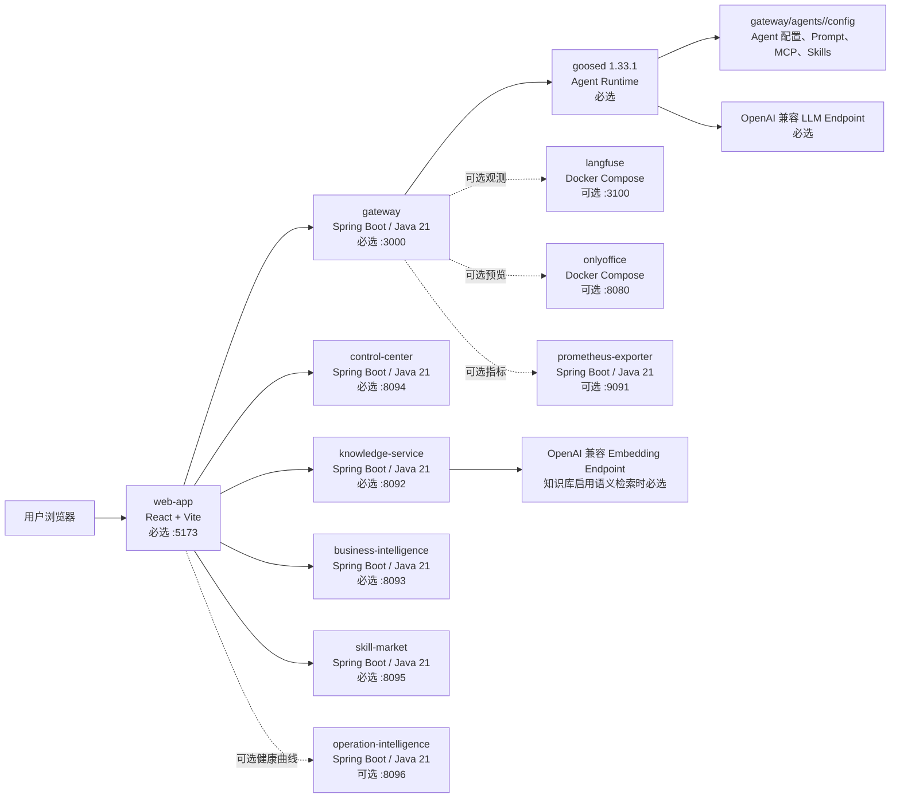

# Ops Factory From Scratch To Running 部署指南

本文档描述在一台全新的 Linux 单机上，从 GitHub 克隆 Ops Factory 代码仓到服务完整启动、验证和排障的全过程。当前部署方式以仓库内已有 `./scripts/ctl.sh` 编排脚本为准，不引入 Nginx 或 systemd 作为必需步骤。

## 整体技术架构



## 服务组件清单

| 组件 | 目录 | 默认端口 | 必选 | 说明 |
| --- | --- | ---: | --- | --- |
| Web App | `web-app/` | `5173` | 是 | 前端 UI，聊天、文件、知识库、控制中心、Skill Market 页面入口 |
| Gateway | `gateway/` | `3000` | 是 | 后端统一入口，管理用户、会话、文件、Agent 配置和 `goosed` 运行时 |
| goosed | 系统 PATH 或绝对路径 | 动态端口 | 是 | Agent runtime，由 Gateway 按用户和 Agent 启动 |
| Knowledge Service | `knowledge-service/` | `8092` | 是 | 文档导入、切片、索引、检索和知识召回 |
| Business Intelligence | `business-intelligence/` | `8093` | 是 | BI 数据 API。当前根启动脚本将其作为必选服务处理 |
| Skill Market | `skill-market/` | `8095` | 是 | Skill 包目录、校验、上传下载 |
| Control Center | `control-center/` | `8094` | 是 | 服务状态、配置、日志和控制入口 |
| OpenAI 兼容 LLM 服务 | 外部服务 | 按实际配置 | 是 | Agent 对话模型接口，当前样例均按 OpenAI 兼容接口配置 |
| Langfuse | `langfuse/` | `3100` | 否 | LLM 观测，可选 Docker Compose 组件 |
| OnlyOffice | `onlyoffice/` | `8080` | 否 | Office 文档预览，可选 Docker Compose 组件 |
| Prometheus Exporter | `prometheus-exporter/` | `9091` | 否 | Gateway 指标导出，可选 Java 服务 |
| Operation Intelligence | `operation-intelligence/` | `8096` | 否 | QoS 健康曲线数据采集、评分与查询 API |
| TypeScript SDK | `typescript-sdk/` | 无 | 否 | 前端依赖本地 SDK，也可独立构建测试 |

## 硬件需求

推荐单机规格：

| 资源 | 推荐值 | 说明 |
| --- | --- | --- |
| CPU | 16 核 | 多个 Java 服务、并发 Agent、知识库处理会消耗 CPU |
| 内存 | 64 GB | 推荐规格，适合完整栈和多个 Agent 会话并行运行 |
| 磁盘 | SSD，至少 200 GB | 代码、Maven/npm 依赖、日志、上传文件、知识库索引和运行时目录都会占用空间 |
| 网络 | 可访问 GitHub、npm、Maven 仓库、LLM Endpoint | 内网环境需要提前配置镜像源或代理 |

最低开发规格可以低于推荐值，例如 8 核 32 GB 也可以运行基础功能，但 Agent 并发、知识库导入和可选 Docker 服务会明显受限。生产或长期测试环境应按实际 Agent 数量、文件上传规模、知识库文档量和日志保留周期扩容。

## Linux 操作系统准备

建议使用普通部署用户运行服务，例如 `opsfactory`。示例部署目录使用 `/opt/ops-factory`，也可以替换为实际目录。

Ubuntu 22.04 / 24.04：

```bash
sudo apt update
sudo apt install -y git curl wget unzip tar bash lsof net-tools ca-certificates gnupg software-properties-common
```

CentOS 7 / Rocky Linux 8+ / AlmaLinux 8+：

```bash
sudo yum install -y git curl wget unzip tar bash lsof net-tools ca-certificates
```

如果系统使用 `dnf`：

```bash
sudo dnf install -y git curl wget unzip tar bash lsof net-tools ca-certificates
```

安装 `ripgrep`，QA CLI Agent 会使用 `rg` 进行高速代码和文本检索。官方仓库是 `https://github.com/BurntSushi/ripgrep`。

Ubuntu：

```bash
sudo apt install -y ripgrep
rg --version
```

CentOS / Rocky / AlmaLinux：

```bash
sudo yum install -y epel-release
sudo yum install -y ripgrep
rg --version
```

如果系统源没有 `ripgrep`，从 GitHub release 下载对应架构的 rpm/deb 包安装。

## Java 21 与 Maven 准备

Gateway 和多个平台服务都是 Java 21 + Maven 项目。

Ubuntu：

```bash
sudo apt update
sudo apt install -y openjdk-21-jdk maven
java -version
javac -version
mvn -version
```

CentOS / Rocky / AlmaLinux：

```bash
sudo yum install -y java-21-openjdk java-21-openjdk-devel maven
java -version
javac -version
mvn -version
```

如果系统仓库没有 Maven 3.9+，可以手动安装 Apache Maven：

```bash
cd /tmp
wget https://archive.apache.org/dist/maven/maven-3/3.9.6/binaries/apache-maven-3.9.6-bin.tar.gz
sudo tar -xzf apache-maven-3.9.6-bin.tar.gz -C /opt
sudo ln -sfn /opt/apache-maven-3.9.6 /opt/maven
echo 'export MAVEN_HOME=/opt/maven' | sudo tee /etc/profile.d/maven.sh
echo 'export PATH=$MAVEN_HOME/bin:$PATH' | sudo tee -a /etc/profile.d/maven.sh
source /etc/profile.d/maven.sh
mvn -version
```

如需显式配置 `JAVA_HOME`：

```bash
readlink -f "$(which java)"
```

根据实际路径写入 `/etc/profile.d/java.sh`，例如：

```bash
echo 'export JAVA_HOME=/usr/lib/jvm/java-21-openjdk-amd64' | sudo tee /etc/profile.d/java.sh
echo 'export PATH=$JAVA_HOME/bin:$PATH' | sudo tee -a /etc/profile.d/java.sh
source /etc/profile.d/java.sh
```

## Node.js 准备

前端、TypeScript SDK、部分 MCP 服务依赖 Node.js。要求 Node.js 18+，建议使用 `nvm`。

```bash
curl -o- https://raw.githubusercontent.com/nvm-sh/nvm/v0.39.7/install.sh | bash
source ~/.bashrc
nvm install 18
nvm use 18
node -v
npm -v
```

内网环境可以配置 npm registry：

```bash
npm config set registry https://registry.npmmirror.com
npm config get registry
```

## Python 准备

后台 daemon 辅助脚本优先使用 `python3` 启动后台进程，部分测试脚本和 MCP 工具也需要 Python。

Ubuntu：

```bash
sudo apt install -y python3 python3-pip python3-venv
python3 --version
pip3 --version
```

CentOS / Rocky / AlmaLinux：

```bash
sudo yum install -y python3 python3-pip
python3 --version
pip3 --version
```

## Docker 准备，可选

Docker 不是主服务必需依赖。只有启用以下组件时才需要 Docker：

- `langfuse`
- `onlyoffice`

Ubuntu 安装示例：

```bash
sudo apt install -y docker.io docker-compose-plugin
sudo systemctl enable --now docker
docker version
docker compose version
```

CentOS / Rocky / AlmaLinux 安装示例：

```bash
sudo yum install -y yum-utils
sudo yum-config-manager --add-repo https://download.docker.com/linux/centos/docker-ce.repo
sudo yum install -y docker-ce docker-ce-cli containerd.io docker-compose-plugin
sudo systemctl enable --now docker
docker version
docker compose version
```

如果不启用 Docker 可选组件，启动时加上：

```bash
ENABLE_ONLYOFFICE=false ENABLE_LANGFUSE=false ./scripts/ctl.sh startup all
```

## goosed 1.33.1 安装

Ops Factory 当前部署固定使用 `goosed 1.33.1`。官方安装指导见 `https://goose-docs.ai/docs/getting-started/installation/`，release 页面见 `https://github.com/aaif-goose/goose/releases`。

Ubuntu / Debian 使用 deb 包：

```bash
cd /tmp
wget https://github.com/aaif-goose/goose/releases/download/v1.33.1/goose_1.33.1_amd64.deb
sudo dpkg -i goose_1.33.1_amd64.deb
sudo apt -f install -y
which goosed
goosed --version
```

CentOS / Rocky / AlmaLinux 使用 rpm 包：

```bash
cd /tmp
wget https://github.com/aaif-goose/goose/releases/download/v1.33.1/Goose-1.33.1-1.x86_64.rpm
sudo yum install -y ./Goose-1.33.1-1.x86_64.rpm
which goosed
goosed --version
```

如果 `goosed` 不在 PATH，可以在 `gateway/config.yaml` 中配置绝对路径：

```yaml
gateway:
  goosed-bin: "/usr/local/bin/goosed"
```

也可以启动时使用环境变量覆盖：

```bash
GOOSED_BIN=/usr/local/bin/goosed ./scripts/ctl.sh startup gateway
```

## 从 GitHub 克隆代码

```bash
sudo mkdir -p /opt
sudo chown "$USER":"$USER" /opt
cd /opt
git clone <your-github-repo-url> ops-factory
cd /opt/ops-factory
git status
```

如果需要指定分支或 tag：

```bash
git fetch --all --tags
git checkout <branch-or-tag>
```

确认脚本权限：

```bash
chmod +x scripts/ctl.sh
chmod +x gateway/scripts/ctl.sh web-app/scripts/ctl.sh
chmod +x knowledge-service/scripts/ctl.sh business-intelligence/scripts/ctl.sh
chmod +x skill-market/scripts/ctl.sh control-center/scripts/ctl.sh
chmod +x prometheus-exporter/scripts/ctl.sh
chmod +x operation-intelligence/scripts/ctl.sh
chmod +x langfuse/scripts/ctl.sh onlyoffice/scripts/ctl.sh
```

## 配置文件准备

复制必选配置：

```bash
cp gateway/config.yaml.example gateway/config.yaml
# 独立运行（standalone）模式
cp web-app/config.standalone.json.example web-app/config.json
# 或壳应用 / embed 模式：
# cp web-app/config.embed.json.example web-app/config.json
# 注意：embed 模式下空 URL 会解析成同源 /gateway、/skill-market、/operation-intelligence 等路径，
# 要求壳应用或部署网关提供对应反向代理。
cp knowledge-service/config.yaml.example knowledge-service/config.yaml
cp business-intelligence/config.yaml.example business-intelligence/config.yaml
cp skill-market/config.yaml.example skill-market/config.yaml
cp control-center/config.yaml.example control-center/config.yaml
cp operation-intelligence/config.yaml.example operation-intelligence/config.yaml
```

复制可选配置：

```bash
cp prometheus-exporter/config.yaml.example prometheus-exporter/config.yaml
cp langfuse/config.yaml.example langfuse/config.yaml
cp onlyoffice/config.yaml.example onlyoffice/config.yaml
```

重点检查 `gateway/config.yaml`：

```yaml
server:
  port: 3000
  address: "0.0.0.0"

gateway:
  secret-key: "change-this-secret"
  cors-origin: "http://127.0.0.1:5173"
  goosed-bin: "goosed"
  goose-tls: true
  skill-market:
    base-url: "http://127.0.0.1:8095"
  knowledge:
    artifacts-root: "../knowledge-service/data/artifacts"
```

重点检查 `web-app/config.json`：

```json
{
    "gatewayUrl": "http://127.0.0.1:3000",
    "gatewaySecretKey": "change-this-secret",
    "controlCenterUrl": "http://127.0.0.1:8094",
    "controlCenterSecretKey": "change-me",
    "knowledgeServiceUrl": "http://127.0.0.1:8092",
    "businessIntelligenceServiceUrl": "http://127.0.0.1:8093",
    "skillMarketServiceUrl": "http://127.0.0.1:8095",
    "operationIntelligenceServiceUrl": "http://127.0.0.1:8096",
    "operationIntelligenceSecretKey": "change-this-oi-secret",
    "port": 5173
}
```

`gateway.secret-key` 必须和 `web-app/config.json` 的 `gatewaySecretKey` 保持一致。`operation-intelligence.secret-key` 必须和 `web-app/config.json` 的 `operationIntelligenceSecretKey` 保持一致。`control-center/config.yaml` 中 gateway 服务的 `auth.secret-key` 也要同步。

## LLM 配置

当前 Agent 样例使用 OpenAI 兼容接口。LLM 配置分为两层：Agent 运行参数和 custom provider JSON。

Agent 运行参数位于：

```text
gateway/agents/<agent-id>/config/config.yaml
```

典型配置：

```yaml
GOOSE_PROVIDER: custom_qwen3.5-27b
GOOSE_MODEL: qwen/qwen3.5-27b
GOOSE_MODE: auto
GOOSE_CONTEXT_LIMIT: '65536'
GOOSE_MAX_TOKENS: '4096'
GOOSE_TEMPERATURE: '0.2'
GOOSE_CONTEXT_STRATEGY: summarize
GOOSE_AUTO_COMPACT_THRESHOLD: '0.8'
GOOSE_MAX_TURNS: '50'
```

`GOOSE_PROVIDER` 必须对应 custom provider JSON 中的 `name`。`GOOSE_MODEL` 必须对应 custom provider JSON 中 `models[].name`。

custom provider JSON 位于：

```text
gateway/agents/<agent-id>/config/custom_providers/*.json
```

典型 OpenAI 兼容配置：

```json
{
  "name": "custom_qwen3.5-27b",
  "engine": "openai",
  "api_key_env": "CUSTOM_OPSAGENTLLM_API_KEY",
  "base_url": "https://openrouter.ai/api/v1/chat/completions",
  "models": [
    {
      "name": "qwen/qwen3.5-27b"
    }
  ]
}
```

API key 放在：

```text
gateway/agents/<agent-id>/config/secrets.yaml
```

可以从样例复制：

```bash
cp gateway/agents/universal-agent/config/secrets.yaml.sample gateway/agents/universal-agent/config/secrets.yaml
```

示例：

```yaml
CUSTOM_OPSAGENTLLM_API_KEY: <your-api-key>
KNOWLEDGE_SERVICE_URL: http://127.0.0.1:8092
KNOWLEDGE_REQUEST_TIMEOUT_MS: '15000'
```

每个 Agent 都有自己的 `config` 目录。需要启用哪个 Agent，就检查对应目录下的 `config.yaml`、`custom_providers/*.json` 和 `secrets.yaml`。

知识库 embedding 配置位于 `knowledge-service/config.yaml`：

```yaml
knowledge:
  embedding:
    base-url: "https://openrouter.ai/api/v1"
    api-key: "<your-api-key>"
    model: "qwen/qwen3-embedding-4b"
    timeout-ms: 30000
    batch-size: 32
    dimensions: 1024
```

部署前建议先验证 LLM endpoint：

```bash
curl -sS "$OPENAI_COMPATIBLE_BASE_URL" \
  -H "Authorization: Bearer $OPENAI_API_KEY"
```

如果服务商要求 `/chat/completions` 或 `/v1/chat/completions` 路径，按服务商文档检查 `base_url` 是否写到正确层级。

## 安装项目依赖

前端：

```bash
cd /opt/ops-factory/web-app
npm install
```

TypeScript SDK：

```bash
cd /opt/ops-factory/typescript-sdk
npm install
```

集成测试依赖，可选：

```bash
cd /opt/ops-factory/test
npm install
```

Gateway 启动脚本会自动构建 Java 包，也会为以下 MCP 子项目执行 `npm install` 和 `npm run build`：

- `gateway/agents/qa-agent/config/mcp/knowledge-service`
- `gateway/agents/qa-cli-agent/config/mcp/knowledge-cli`

如果内网环境 Maven 下载慢或失败，配置 Maven mirror。示例 `~/.m2/settings.xml`：

```xml
<settings>
  <mirrors>
    <mirror>
      <id>aliyunmaven</id>
      <mirrorOf>*</mirrorOf>
      <name>Aliyun Maven</name>
      <url>https://maven.aliyun.com/repository/public</url>
    </mirror>
  </mirrors>
</settings>
```

## Build

`./scripts/ctl.sh startup` 会在服务启动前按需 build。也可以手动提前构建。

```bash
cd /opt/ops-factory/gateway && mvn package -DskipTests
cd /opt/ops-factory/knowledge-service && mvn package -DskipTests
cd /opt/ops-factory/business-intelligence && mvn package -DskipTests
cd /opt/ops-factory/skill-market && mvn package -DskipTests
cd /opt/ops-factory/control-center && mvn package -DskipTests
cd /opt/ops-factory/operation-intelligence && mvn package -DskipTests
cd /opt/ops-factory/web-app && npm run build
```

可选组件：

```bash
cd /opt/ops-factory/prometheus-exporter && mvn package -DskipTests
cd /opt/ops-factory/typescript-sdk && npm run build
```

## 启动服务

回到仓库根目录：

```bash
cd /opt/ops-factory
```

完整启动：

```bash
./scripts/ctl.sh startup all
```

不启用 Docker 可选组件：

```bash
ENABLE_ONLYOFFICE=false ENABLE_LANGFUSE=false ./scripts/ctl.sh startup all
```

不启用 Prometheus Exporter：

```bash
ENABLE_EXPORTER=false ./scripts/ctl.sh startup all
```

不启用所有可选组件：

```bash
ENABLE_ONLYOFFICE=false ENABLE_LANGFUSE=false ENABLE_EXPORTER=false ENABLE_OPERATION_INTELLIGENCE=false ./scripts/ctl.sh startup all
```

设置 Gateway REST API password：

```bash
./scripts/ctl.sh startup --apipwd '<your-api-password>' all
```

启动指定组件：

```bash
./scripts/ctl.sh startup gateway webapp
./scripts/ctl.sh startup knowledge skill-market control-center
```

查看状态：

```bash
./scripts/ctl.sh status
```

重启：

```bash
./scripts/ctl.sh restart gateway
./scripts/ctl.sh restart webapp
```

停止：

```bash
./scripts/ctl.sh shutdown all
```

## 部署验证

先检查进程和端口：

```bash
./scripts/ctl.sh status
lsof -nP -iTCP -sTCP:LISTEN | egrep ':(3000|5173|8092|8093|8094|8095|8096|9091|3100|8080)'
```

检查 HTTP 健康状态：

```bash
curl -fsS -H 'x-secret-key: change-this-secret' http://127.0.0.1:3000/gateway/status
curl -fsS http://127.0.0.1:8092/actuator/health
curl -fsS http://127.0.0.1:8093/actuator/health
curl -fsS http://127.0.0.1:8094/actuator/health
curl -fsS http://127.0.0.1:8095/actuator/health
curl -fsS http://127.0.0.1:8096/actuator/health
curl -fsS http://127.0.0.1:5173
```

浏览器访问：

```text
http://<server-ip>:5173
```

UI 验证建议按顺序执行：

1. 首页能打开，浏览器控制台没有持续网络错误。
2. Agent 列表能加载。
3. 选择 `universal-agent` 创建会话。
4. 发送一条简单消息，确认 LLM 能返回。
5. 打开 Knowledge 页面，确认 Knowledge Service 可访问。
6. 打开 Skill Market 页面，确认 Skill Market 可访问。
7. 打开 Control Center，确认各服务状态能显示。
8. 如果启用了 OnlyOffice，上传 Office 文件验证预览。
9. 如果启用了 Langfuse，确认 Langfuse 页面和 Gateway 配置的 key 一致。

## 日志与运行目录

后台启动时，各服务会将 PID 写入自己的 `logs/*.pid` 文件，并将日志写入 `logs/` 目录。

| 组件 | PID 文件 | 主要日志 |
| --- | --- | --- |
| Gateway | `gateway/logs/gateway.pid` | `gateway/logs/gateway.log`、`gateway/logs/gateway-stdout-stderr.log` |
| Web App | `web-app/logs/webapp.pid` | `web-app/logs/webapp.log` |
| Knowledge Service | `knowledge-service/logs/knowledge-service.pid` | `knowledge-service/logs/knowledge-service.log`、`knowledge-service/logs/knowledge-service-console.log` |
| Business Intelligence | `business-intelligence/logs/business-intelligence.pid` | `business-intelligence/logs/business-intelligence.log` |
| Skill Market | `skill-market/logs/skill-market.pid` | `skill-market/logs/skill-market.log`、`skill-market/logs/skill-market-console.log` |
| Control Center | `control-center/logs/control-center.pid` | `control-center/logs/control-center.log` |
| Prometheus Exporter | `prometheus-exporter/logs/prometheus-exporter.pid` | `prometheus-exporter/logs/exporter.log` |
| Operation Intelligence | `operation-intelligence/logs/operation-intelligence.pid` | `operation-intelligence/logs/operation-intelligence.log` |
| Langfuse | Docker | `docker compose -f langfuse/docker-compose.yml logs -f` |
| OnlyOffice | Docker | `docker compose -f onlyoffice/docker-compose.yml logs -f` |

常用日志命令：

```bash
tail -f gateway/logs/gateway.log
tail -f gateway/logs/gateway-stdout-stderr.log
tail -f web-app/logs/webapp.log
tail -f knowledge-service/logs/knowledge-service.log
tail -f knowledge-service/logs/knowledge-service-console.log
tail -f skill-market/logs/skill-market.log
tail -f control-center/logs/control-center.log
```

查看最近错误：

```bash
grep -RniE 'error|exception|failed|timeout|refused|unauthorized|forbidden' \
  gateway/logs web-app/logs knowledge-service/logs business-intelligence/logs skill-market/logs control-center/logs
```

查看 PID 对应进程：

```bash
cat gateway/logs/gateway.pid
ps -fp "$(cat gateway/logs/gateway.pid)"
```

运行时目录：

| 目录 | 说明 |
| --- | --- |
| `gateway/agents/<agent-id>/config/` | Agent 的配置、prompt、custom provider、MCP、skills |
| `gateway/users/<user-id>/agents/<agent-id>/` | 用户级 Agent 运行目录，Gateway 启动 `goosed` 时会使用 |
| `gateway/users/<user-id>/agents/<agent-id>/logs/` | Agent / MCP 运行日志可能写入这里 |
| `knowledge-service/data/` | 知识库运行数据、索引和 artifacts |
| `skill-market/data/` | Skill Market 包和元数据 |
| `business-intelligence/data/` | BI 源数据目录 |

排查 Agent 或 MCP 问题时，优先看：

```bash
find gateway/users -path '*logs*' -type f | sort
find gateway/users -maxdepth 8 -path '*logs*' -type f -print -exec tail -n 80 {} \;
```

如果需要提高 Knowledge Service 日志级别，可以临时这样启动：

```bash
KNOWLEDGE_LOG_LEVEL_APP=DEBUG KNOWLEDGE_LOG_LEVEL_EMBEDDING=DEBUG ./scripts/ctl.sh restart knowledge
```

如果需要提高 Skill Market 日志级别：

```bash
SKILL_MARKET_LOG_LEVEL_APP=DEBUG ./scripts/ctl.sh restart skill-market
```

## 问题排查

### 1. 先判断是哪一层失败

按下面顺序检查：

```bash
./scripts/ctl.sh status
lsof -nP -iTCP -sTCP:LISTEN | egrep ':(3000|5173|8092|8093|8094|8095|8096|9091|3100|8080)'
tail -n 200 gateway/logs/gateway.log
tail -n 200 web-app/logs/webapp.log
```

如果 `status` 显示服务未运行，优先看该服务日志。如果服务进程在但 health check 失败，说明端口监听、配置或依赖初始化可能异常。

### 2. 端口被占用

现象：

- 启动日志出现 `port ... is occupied`
- `status` 显示端口被 unmanaged process 占用

排查：

```bash
lsof -nP -iTCP:3000 -sTCP:LISTEN
lsof -nP -iTCP:5173 -sTCP:LISTEN
```

处理：

```bash
kill <pid>
```

然后重新启动对应服务：

```bash
./scripts/ctl.sh restart gateway
./scripts/ctl.sh restart webapp
```

### 3. Java 或 Maven 问题

现象：

- `mvn: command not found`
- `release version 21 not supported`
- Maven build failed

排查：

```bash
java -version
javac -version
mvn -version
tail -n 200 gateway/logs/gateway-stdout-stderr.log
```

处理：

- 确认 Java 是 21。
- 确认 `JAVA_HOME` 指向 JDK，不是 JRE。
- 内网环境配置 Maven mirror。
- 单独进入失败服务目录执行 `mvn package -DskipTests`，查看完整错误。

### 4. Node.js 或 npm 问题

现象：

- `node: command not found`
- `npm install` 失败
- Web App 无法启动
- Gateway 启动时 MCP build 失败

排查：

```bash
node -v
npm -v
tail -n 200 web-app/logs/webapp.log
```

处理：

```bash
cd web-app && npm install
cd ../gateway/agents/qa-agent/config/mcp/knowledge-service && npm install && npm run build
cd ../../../../qa-cli-agent/config/mcp/knowledge-cli && npm install && npm run build
```

内网环境配置 npm registry 后重试。

### 5. `goosed` 找不到或版本不对

现象：

- Gateway 可启动，但创建 Agent 会话失败。
- Gateway 日志出现 `goosed` 启动失败、`No such file`、`command not found`。

排查：

```bash
which goosed
goosed --version
grep -RniE 'goosed|GOOSED_BIN|No such file|command not found' gateway/logs
```

处理：

- 安装 `goosed 1.33.1`。
- 确认部署用户的 PATH 中能找到 `goosed`。
- 或在 `gateway/config.yaml` 写绝对路径：

```yaml
gateway:
  goosed-bin: "/usr/local/bin/goosed"
```

然后：

```bash
./scripts/ctl.sh restart gateway
```

### 6. `rg` 找不到

现象：

- QA CLI Agent 进行代码检索或知识检索相关任务时报错。
- 日志中出现 `rg: command not found`。

排查：

```bash
which rg
rg --version
grep -Rni 'rg: command not found' gateway/logs gateway/users
```

处理：安装 `ripgrep` 后重启 Gateway 或重新创建 Agent 会话。

### 7. Web App 连不上 Gateway

现象：

- 页面打开但 API 请求失败。
- 浏览器控制台出现 `401`、`403`、`Failed to fetch`、CORS 错误。

排查：

```bash
cat web-app/config.json
rg -n 'secret-key|cors-origin|port' gateway/config.yaml
curl -i -H 'x-secret-key: change-this-secret' http://127.0.0.1:3000/gateway/status
tail -n 200 gateway/logs/gateway.log
```

处理：

- `web-app/config.json.gatewayUrl` 指向实际 Gateway 地址。
- `web-app/config.json.gatewaySecretKey` 和 `gateway/config.yaml.gateway.secret-key` 一致。
- `gateway.config.yaml.gateway.cors-origin` 包含前端访问地址。
- 如果从其他机器浏览器访问，不能继续使用只对本机有效的 `127.0.0.1` 作为前端配置中的后端地址，应改成服务器 IP 或域名。

### 8. Gateway API password 问题

`gateway.secret-key` 用于 Gateway 和前端/Control Center 的内部鉴权。`GATEWAY_API_PASSWORD` 是 Gateway REST 接口密码，启动脚本支持：

```bash
./scripts/ctl.sh startup --apipwd '<your-api-password>' all
```

如果忘记了启动时传入的 password，直接重启并重新传入：

```bash
./scripts/ctl.sh shutdown gateway
./scripts/ctl.sh startup --apipwd '<new-api-password>' gateway
```

### 9. LLM 配置错误

现象：

- Agent 会话能创建，但回复失败。
- 返回认证错误、模型不存在、404、429、timeout。

排查：

```bash
rg -n 'GOOSE_PROVIDER|GOOSE_MODEL' gateway/agents/*/config/config.yaml
find gateway/agents -maxdepth 5 -path '*/custom_providers/*.json' -type f -print
grep -RniE '401|403|404|429|model|api key|base_url|timeout|provider' gateway/logs gateway/users
```

重点检查：

- `GOOSE_PROVIDER` 是否等于 custom provider JSON 的 `name`。
- `GOOSE_MODEL` 是否存在于 custom provider JSON 的 `models[].name`。
- `api_key_env` 指向的环境变量是否在 `secrets.yaml` 中存在。
- `base_url` 是否符合服务商 OpenAI 兼容接口要求。
- 如果服务商需要 `/v1`，不要漏写；如果服务商要求完整 `/chat/completions`，也要按服务商要求写。

### 10. Knowledge Service 或 embedding 失败

现象：

- Knowledge 页面报错。
- 文档导入失败。
- 检索没有语义结果。

排查：

```bash
curl -fsS http://127.0.0.1:8092/actuator/health
tail -n 300 knowledge-service/logs/knowledge-service.log
grep -RniE 'embedding|api-key|timeout|dimension|sqlite|database|ingest|index' knowledge-service/logs
```

重点检查 `knowledge-service/config.yaml`：

- `knowledge.runtime.base-dir` 是否可写。
- `knowledge.embedding.base-url` 是否可访问。
- `knowledge.embedding.api-key` 是否有效。
- `knowledge.embedding.model` 和 `dimensions` 是否匹配实际 embedding 服务。
- 上传文件是否超过 `knowledge.ingest.max-file-size-mb`。

### 11. Skill Market 失败

排查：

```bash
curl -fsS http://127.0.0.1:8095/actuator/health
tail -n 300 skill-market/logs/skill-market.log
grep -RniE 'package|upload|unpack|permission|failed|exception' skill-market/logs
```

重点检查：

- `skill-market/config.yaml.skill-market.runtime.base-dir` 是否可写。
- `gateway/config.yaml.gateway.skill-market.base-url` 和 `web-app/config.json.skillMarketServiceUrl` 是否一致。
- 上传包是否超过大小、文件数或单文件限制。

### 12. Control Center 显示服务异常

排查：

```bash
curl -fsS http://127.0.0.1:8094/actuator/health
tail -n 300 control-center/logs/control-center.log
cat control-center/config.yaml
```

重点检查：

- `control-center.secret-key` 是否和 `web-app/config.json.controlCenterSecretKey` 一致。
- `control-center.services[].base-url` 是否指向真实服务地址。
- Gateway 服务项中的 `auth.secret-key` 是否和 `gateway.secret-key` 一致。
- `log-path` 和 `config-path` 是否相对仓库根目录有效。

### 13. Docker 可选组件失败

Langfuse：

```bash
docker ps
docker compose -f langfuse/docker-compose.yml ps
docker compose -f langfuse/docker-compose.yml logs -f
curl -fsS http://127.0.0.1:3100/api/public/health
```

OnlyOffice：

```bash
docker ps
docker compose -f onlyoffice/docker-compose.yml ps
docker compose -f onlyoffice/docker-compose.yml logs -f
curl -fsS http://127.0.0.1:8080/healthcheck
```

如果不需要这两个组件，直接禁用：

```bash
ENABLE_ONLYOFFICE=false ENABLE_LANGFUSE=false ./scripts/ctl.sh startup all
```

### 14. 服务进程存在但状态检查失败

排查：

```bash
ps -ef | egrep 'gateway-service|knowledge-service|business-intelligence|skill-market|control-center|vite|goosed' | grep -v grep
./scripts/ctl.sh status
tail -n 200 <service>/logs/<service>.log
```

处理：

```bash
./scripts/ctl.sh restart <component>
```

如果 PID 文件陈旧，脚本通常会自动清理。仍异常时，先确认不是其他用户启动了同端口进程，再手动停止对应 PID。

### 15. goosed 会话或 MCP 工具异常

排查 Gateway 日志：

```bash
grep -RniE 'goosed|session|mcp|extension|spawn|resume|health' gateway/logs
```

排查用户运行目录：

```bash
find gateway/users -type f -path '*logs*' -print
find gateway/users -type f -path '*logs*' -exec sh -c 'echo "### $1"; tail -n 120 "$1"' sh {} \;
```

常见原因：

- Agent 的 `secrets.yaml` 缺少 key。
- custom provider JSON 和 `GOOSE_PROVIDER` 不匹配。
- MCP 子项目没有 `npm install` 或 build 失败。
- 系统缺少 `rg`、`python3`、`node` 等命令。
- LLM endpoint 超时或拒绝请求。

## 升级、重启与维护

升级前备份配置和运行数据：

```bash
cd /opt/ops-factory
tar -czf /tmp/ops-factory-config-backup-$(date +%Y%m%d%H%M%S).tar.gz \
  gateway/config.yaml web-app/config.json knowledge-service/config.yaml \
  business-intelligence/config.yaml skill-market/config.yaml control-center/config.yaml \
  operation-intelligence/config.yaml \
  gateway/agents knowledge-service/data skill-market/data business-intelligence/data
```

升级流程：

```bash
./scripts/ctl.sh shutdown all
git pull
cd web-app && npm install && npm run build
cd ../typescript-sdk && npm install && npm run build
cd ../gateway && mvn package -DskipTests
cd ../knowledge-service && mvn package -DskipTests
cd ../business-intelligence && mvn package -DskipTests
cd ../skill-market && mvn package -DskipTests
cd ../control-center && mvn package -DskipTests
cd ..
ENABLE_ONLYOFFICE=false ENABLE_LANGFUSE=false ENABLE_EXPORTER=false ENABLE_OPERATION_INTELLIGENCE=false ./scripts/ctl.sh startup all
./scripts/ctl.sh status
```

日常维护建议：

- 定期检查 `logs/` 占用：`du -sh */logs`。
- 定期检查运行数据：`du -sh gateway/users knowledge-service/data skill-market/data business-intelligence/data`。
- 不要删除长期用户数据，例如 `gateway/users/admin` 下真实会话数据。
- 临时测试用户、临时 e2e/debug 目录可以在确认无用后清理。

## 附录：常用命令

服务控制：

```bash
./scripts/ctl.sh startup all
./scripts/ctl.sh status
./scripts/ctl.sh restart gateway
./scripts/ctl.sh shutdown all
```

跳过可选服务：

```bash
ENABLE_ONLYOFFICE=false ENABLE_LANGFUSE=false ENABLE_EXPORTER=false ENABLE_OPERATION_INTELLIGENCE=false ./scripts/ctl.sh startup all
```

端口检查：

```bash
lsof -nP -iTCP -sTCP:LISTEN
lsof -nP -iTCP:3000 -sTCP:LISTEN
```

日志检查：

```bash
tail -f gateway/logs/gateway.log
tail -f web-app/logs/webapp.log
tail -f knowledge-service/logs/knowledge-service.log
```

健康检查：

```bash
curl -fsS -H 'x-secret-key: change-this-secret' http://127.0.0.1:3000/gateway/status
curl -fsS http://127.0.0.1:8092/actuator/health
curl -fsS http://127.0.0.1:8093/actuator/health
curl -fsS http://127.0.0.1:8094/actuator/health
curl -fsS http://127.0.0.1:8095/actuator/health
```

版本检查：

```bash
java -version
mvn -version
node -v
npm -v
python3 --version
goosed --version
rg --version
```
