# Commerce Solution Network Topology

> Solution: bes_pr1 (540d4035-e461-4c95-acb3-0f1f187c374d)
> K8s Cluster: bes_pr1 (Master: 192.171.37.221)

```mermaid
graph TB
    Sol["Commerce Solution<br/>bes_pr1"]

    subgraph MW["Middleware"]
        Redis["Redis Cluster<br/>2 PODs"]
        RedisSentinel["Redis Sentinel<br/>1 POD"]
        ZK["ZooKeeper<br/>1 POD"]
        JetMQ["jetMQ<br/>1 POD"]
        VSearch["VSearch<br/>1 POD"]
        LSS["LSS<br/>1 POD"]
        DDS_FE["DDS Frontend<br/>1 POD"]
        DDS_BE["DDS Backend<br/>1 POD"]
        BDI["BDI<br/>1 POD"]
        KMS["KMS - no POD"]
    end

    subgraph Platform["Platform Services"]
        LodasPortal["LodasService Portal<br/>1 POD"]
        LodasFeature["LodasService Feature<br/>1 POD"]
        LodasTraining["LodasService Training<br/>1 POD"]
        LodasRM["LodasService RunningMaster<br/>1 POD"]
        LodasRW["LodasService RunningWorker<br/>1 POD"]
        DBAgent["DBAgent<br/>1 POD"]
    end

    subgraph App["Application Services"]
        BHB["BHB<br/>2 PODs"]
        BHF["BHF<br/>2 PODs"]
        BatchExec["BatchExecutor<br/>1 POD"]
        EMGW["EMGW<br/>1 POD"]
        CLE["CLE IF<br/>1 POD"]
        OrderSched["OrderScheduler<br/>2 PODs"]
        MktExec["MarketingMgmtExec<br/>1 POD"]
        LoyaltyCal["LoyaltyCalEngine<br/>1 POD"]
        ProExe["ProExeandTag<br/>1 POD"]
        RetailPortal["RetailShopPortal<br/>2 PODs"]
        SearchCenter["SearchCenter<br/>2 PODs"]
        MgmtPortal["MgmtPortal<br/>2 PODs"]
        FileServer["FILESERVER<br/>1 POD"]
        CAS["CentralAuthService<br/>1 POD"]
    end

    subgraph GW["Network Gateway"]
        NSLB_SHOP["NSLB SHOP<br/>1 Container"]
        NSLB_IF["NSLB IF<br/>1 Container"]
        NSLB_SFTP["NSLB SFTP<br/>1 Container"]
        APIIn["API Access In<br/>1 POD"]
        APIOut["API Access Out<br/>1 POD"]
        APIGov["API Governance<br/>1 POD"]
        APIPortal["API Portal<br/>1 POD"]
    end

    subgraph Node233["Worker 192.171.233.150 - 8 PODs"]
        n233_redis_m["redis-master-0 172.16.1.111"]
        n233_redis_s["redis-sentinel-0 172.16.1.112"]
        n233_dds_fe["dds-frontend-0 172.16.1.113"]
        n233_vsearch["vsearch-0 172.16.1.115"]
        n233_bdi["bdi-docker-1 172.16.1.116"]
        n233_api_in["apiaccess-in 172.16.1.118"]
        n233_rm["lodas-running-master 172.16.1.119"]
        n233_loyalty["loyalty-cal-engine 172.16.1.120"]
    end

    subgraph Node91["Worker 192.171.91.23 - 8 PODs"]
        n91_dbagent["dbagent-0 172.16.1.200"]
        n91_redis_sl["redis-slave-0 172.16.1.201"]
        n91_portal["lodas-portal 172.16.1.202"]
        n91_rw["lodas-running-worker 172.16.1.206"]
        n91_cle["cle 172.16.1.207"]
        n91_retail["retail-shop-portal 172.16.1.208"]
        n91_mgmt["mgmt-portal 172.16.1.209"]
        n91_sched["order-scheduler 172.16.1.210"]
    end

    subgraph Node247["Worker 192.171.247.220 - 6 PODs"]
        n247_zk["zookeeper-0 172.16.2.118"]
        n247_jmq["jetmq-0 172.16.2.119"]
        n247_bhf["bhf 172.16.2.67"]
        n247_batch["batch-executor 172.16.2.126"]
        n247_sched["order-scheduler 172.16.2.66"]
        n247_sc["search-center 172.16.2.68"]
    end

    subgraph Node150["Worker 192.171.150.80 - 5 PODs"]
        n150_lodas_f["lodas-feature 172.16.1.134"]
        n150_bhb["bhb 172.16.1.137"]
        n150_sc["search-center 172.16.1.138"]
        n150_retail["retail-shop-portal 172.16.1.139"]
        n150_proexe["pro-exe-and-tag 172.16.1.136"]
    end

    subgraph Node172["Worker 192.171.172.46 - 5 PODs"]
        n172_dds_be["dds-backend-0 172.16.3.45"]
        n172_train["lodas-training 172.16.3.47"]
        n172_cas["cas 172.16.3.48"]
        n172_api_out["apiaccess-out 172.16.3.51"]
        n172_bhb["bhb 172.16.3.52"]
    end

    subgraph Node112["Worker 192.171.112.129 - 5 PODs"]
        n112_lss["lss-0 192.171.112.129"]
        n112_bhf["bhf 172.16.2.245"]
        n112_mkt["marketing-exec 172.16.2.246"]
        n112_mgmt["mgmt-portal 172.16.2.247"]
        n112_api_pt["api-portal 172.16.2.239"]
    end

    subgraph Node182["Worker 192.171.182.181 - 2 PODs"]
        n182_api_gov["api-governance 172.16.4.13"]
        n182_emgw["emgw 172.16.4.17"]
    end

    subgraph Node234["Worker 192.171.234.38 - 1 POD"]
        n234_fs["fileserver 172.16.3.108"]
    end

    subgraph External["External - not in K8s"]
        ext_nslb_shop["NSLB SHOP 192.171.1.123"]
        ext_nslb_if["NSLB IF/SFTP 192.171.121.9"]
    end

    Sol --> MW
    Sol --> Platform
    Sol --> App
    Sol --> GW

    Redis --> n233_redis_m
    Redis --> n91_redis_sl
    RedisSentinel --> n233_redis_s
    ZK --> n247_zk
    JetMQ --> n247_jmq
    VSearch --> n233_vsearch
    LSS --> n112_lss
    DDS_FE --> n233_dds_fe
    DDS_BE --> n172_dds_be
    BDI --> n233_bdi
    LodasPortal --> n91_portal
    LodasFeature --> n150_lodas_f
    LodasTraining --> n172_train
    LodasRM --> n233_rm
    LodasRW --> n91_rw
    DBAgent --> n91_dbagent
    BHB --> n150_bhb
    BHB --> n172_bhb
    BHF --> n247_bhf
    BHF --> n112_bhf
    BatchExec --> n247_batch
    EMGW --> n182_emgw
    CLE --> n91_cle
    OrderSched --> n247_sched
    OrderSched --> n91_sched
    MktExec --> n112_mkt
    LoyaltyCal --> n233_loyalty
    ProExe --> n150_proexe
    RetailPortal --> n150_retail
    RetailPortal --> n91_retail
    SearchCenter --> n150_sc
    SearchCenter --> n247_sc
    MgmtPortal --> n91_mgmt
    MgmtPortal --> n112_mgmt
    FileServer --> n234_fs
    CAS --> n172_cas
    APIIn --> n233_api_in
    APIOut --> n172_api_out
    APIGov --> n182_api_gov
    APIPortal --> n112_api_pt
    NSLB_SHOP --> ext_nslb_shop
    NSLB_IF --> ext_nslb_if
    NSLB_SFTP --> ext_nslb_if
```

## Summary Statistics

| Category | Count | Total PODs |
|----------|-------|-----------|
| Middleware | 10 | 10 |
| Platform Services | 6 | 6 |
| Application Services | 15 | 17 |
| Network Gateway | 7 | 4 PODs + 3 Containers |
| **Total** | **38 services** | **40 PODs + 3 Containers** |

## Worker Node Distribution

| Worker Node | POD Count | Services |
|-------------|-----------|----------|
| 192.171.233.150 | 8 | Redis master/sentinel, DDS FE, VSearch, BDI, API Access In, RunningMaster, LoyaltyCalEngine |
| 192.171.91.23 | 8 | Redis slave, DBAgent, Lodas Portal/RunningWorker, CLE, RetailPortal, MgmtPortal, OrderScheduler |
| 192.171.247.220 | 6 | ZooKeeper, jetMQ, BHF, BatchExecutor, OrderScheduler, SearchCenter |
| 192.171.150.80 | 5 | Lodas Feature, BHB, SearchCenter, RetailPortal, ProExeandTag |
| 192.171.172.46 | 5 | DDS Backend, Lodas Training, CAS, API Access Out, BHB |
| 192.171.112.129 | 5 | LSS, BHF, MarketingMgmtExec, MgmtPortal, API Portal |
| 192.171.182.181 | 2 | EMGW, API Governance |
| 192.171.234.38 | 1 | FILESERVER |
